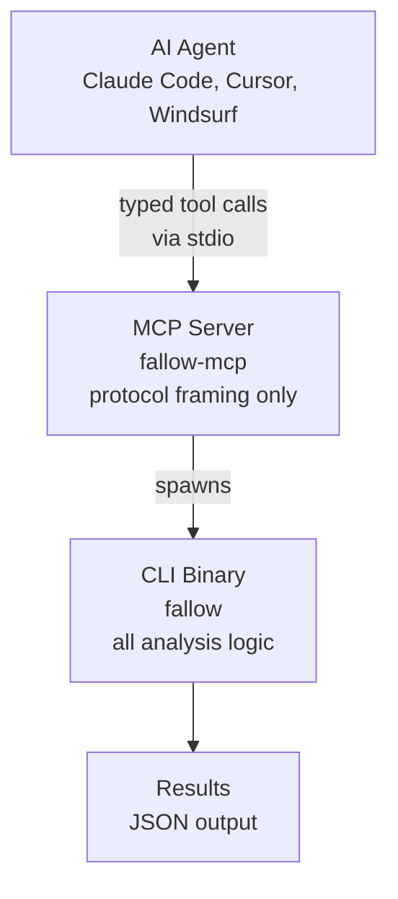

# Fallow agent integration

> Integrate fallow with AI agents via CLI and MCP. Unused code, duplication, complexity hotspots, boundary violations, and auto-fix in Claude Code, Cursor, and Windsurf.

AI coding agents generate code at scale, but they don't perform codebase-level analysis. Building a module graph, tracing re-export chains, detecting duplication across thousands of files, scoring complexity hotspots: these require a dedicated tool. Fallow provides deterministic, exhaustive codebase analysis that agents call via CLI or MCP.

<Info>
  Every agent that can run shell commands can use fallow. The CLI is the primary interface. MCP is an optional structured layer on top.
</Info>

## Why agents need fallow

Codebase analysis means building and traversing a graph, not reading files in a context window.

| What agents can't do                                             | What fallow does                                        |
| :--------------------------------------------------------------- | :------------------------------------------------------ |
| Build a complete module graph across 5,000+ files                | Builds the full graph in \~200ms                        |
| Track re-export chains through barrel files                      | Resolves `export *` chains through unlimited levels     |
| Know if an export is used somewhere outside their context window | Exhaustively checks every import in the entire codebase |
| Detect code duplication across files they haven't seen           | Suffix array algorithm catches clones across all files  |
| Determine which `package.json` dependencies are actually unused  | Traces imports and script binaries to actual usage      |
| Guarantee completeness (no missed files, no false negatives)     | Deterministic: same input always produces same output   |

<Info>
  Static analysis requires building and traversing a module graph. No amount of context window makes an LLM equivalent to a graph algorithm.
</Info>

## CLI: the primary agent interface

Every AI coding agent can run shell commands. No MCP required:

```bash theme={null}
# Full dead code analysis with JSON output
fallow dead-code --format json

# Only check changed files (great for agent PR workflows)
fallow dead-code --changed-since main --format json

# Find code duplication
fallow dupes --format json

# Preview what auto-fix would remove
fallow fix --dry-run --format json

# Apply fixes (agents should use --yes to skip confirmation)
fallow fix --yes --format json

# Detect feature flags and environment gates
fallow flags --format json

# List project info (plugins, entry points, file count)
fallow list --format json
```

<Tip>
  Always use `--format json` when agents run fallow. JSON output is structured, machine-readable, and easy for LLMs to parse. The human-readable format works too, but JSON eliminates parsing ambiguity.
</Tip>

<Tip>
  Consuming fallow's JSON output from TypeScript? `import type { CheckOutput, HealthOutput, DupesOutput, AuditOutput } from "fallow/types"` exposes the full output contract, generated from the same schema fallow uses internally. `SchemaVersion` is pinned to a literal at codegen time so major schema bumps fail to compile at your call sites instead of silently drifting.
</Tip>

### Agent workflow examples

**After generating code:**

```bash theme={null}
# Agent generates a new feature, commits, then checks its own work
fallow dead-code --changed-since main --format json
# → finds that the old utility file is now unused
# → agent removes it
```

**Codebase cleanup:**

```bash theme={null}
# Agent is asked to clean up dead code
fallow dead-code --format json
# → returns 401 issues: unused files, exports, dependencies
fallow fix --yes --format json
# → auto-removes unused exports and dependencies
# Agent then deletes unused files from the JSON output
```

**Before a PR:**

```bash theme={null}
# Agent verifies its changes don't introduce dead code
fallow dead-code --changed-since main --format json
# → clean: no new issues introduced
```

## MCP: structured tool calling

For agents that support <Tooltip tip="An open standard that lets AI agents call external tools through structured, typed interfaces">[MCP (Model Context Protocol)](https://modelcontextprotocol.io)</Tooltip>, `fallow-mcp` exposes analysis as structured tools. Agents get typed inputs and outputs instead of parsing CLI text.

The MCP server uses <Tooltip tip="Communication via standard input/output streams between parent and child processes">stdio transport</Tooltip> and wraps the `fallow` CLI binary. Set the `FALLOW_BIN` environment variable to point to the fallow binary (defaults to `fallow` in `PATH`).

<Tabs>
  <Tab title="Claude Code">
    Add to your `.claude/settings.json`:

```json theme={null}
{
  "mcpServers": {
    "fallow": {
      "command": "fallow-mcp"
    }
  }
}
```

  </Tab>

  <Tab title="Cursor">
    Add to your Cursor MCP settings:

```json theme={null}
{
  "mcpServers": {
    "fallow": {
      "command": "fallow-mcp"
    }
  }
}
```

  </Tab>

  <Tab title="Other MCP clients">
    Any MCP-compatible client can connect to `fallow-mcp`. The server uses stdio transport:

    ```bash theme={null}
    # Start the MCP server directly
    fallow-mcp

    # With a custom fallow binary path
    FALLOW_BIN=/usr/local/bin/fallow fallow-mcp
    ```

```text
Configure your client to launch `fallow-mcp` as a stdio subprocess.
```

  </Tab>
</Tabs>

### Available MCP tools

| Tool                     | Description                                                                                                                                                                                                                                                                                                                                                                                                                                                                                                                                                                                                                                                                                                                                                                                                                                                                                                                                                            |
| :----------------------- | :--------------------------------------------------------------------------------------------------------------------------------------------------------------------------------------------------------------------------------------------------------------------------------------------------------------------------------------------------------------------------------------------------------------------------------------------------------------------------------------------------------------------------------------------------------------------------------------------------------------------------------------------------------------------------------------------------------------------------------------------------------------------------------------------------------------------------------------------------------------------------------------------------------------------------------------------------------------------- |
| `analyze`                | Full dead code analysis (`fallow dead-code --format json`). Detects unused files, exports, types, dependencies, enum/class members, unresolved imports, unlisted dependencies, duplicate exports, circular dependencies, boundary violations, stale suppressions, unused pnpm catalog entries, and unresolved pnpm catalog references (consumer `package.json` references a catalog that does not declare the package; `pnpm install` would fail). Private type leaks are opt-in via `issue_types: ["private-type-leaks"]`.                                                                                                                                                                                                                                                                                                                                                                                                                                            |
| `check_changed`          | Incremental analysis of changed files (`fallow dead-code --changed-since`)                                                                                                                                                                                                                                                                                                                                                                                                                                                                                                                                                                                                                                                                                                                                                                                                                                                                                             |
| `find_dupes`             | Code duplication detection (`fallow dupes --format json`)                                                                                                                                                                                                                                                                                                                                                                                                                                                                                                                                                                                                                                                                                                                                                                                                                                                                                                              |
| `fix_preview`            | Dry-run auto-fix preview (`fallow fix --dry-run --format json`)                                                                                                                                                                                                                                                                                                                                                                                                                                                                                                                                                                                                                                                                                                                                                                                                                                                                                                        |
| `fix_apply`              | Apply auto-fixes (`fallow fix --yes --format json`)                                                                                                                                                                                                                                                                                                                                                                                                                                                                                                                                                                                                                                                                                                                                                                                                                                                                                                                    |
| `check_health`           | Complexity metrics, file health scores, hotspots, and refactoring targets (`fallow health --format json`). Set `file_scores: true` for maintainability index, `hotspots: true` for churn analysis, `targets: true` for ranked recommendations sorted by efficiency, `trend: true` for per-metric deltas against the most recent snapshot. Set `group_by` to `owner`, `directory`, `package`, or `section` to partition results: each group gets its own `vital_signs` and `health_score` recomputed from the group's files (top-level metrics stay project-wide), SARIF results gain `properties.group`, CodeClimate issues gain a top-level `group` field. Findings include a bucketed `coverage_tier` (`none`/`partial`/`high`) for CRAP-triggered entries and an `actions` array whose primary entry is `add-tests` / `increase-coverage` (when coverage can still clear CRAP) or `refactor-function` (when cyclomatic >= maxCrap), see "Structured actions" below. |
| `check_runtime_coverage` | Merge runtime-coverage data into the health report. Required `coverage` param accepts a V8 coverage directory, a single V8 coverage JSON, or an Istanbul `coverage-final.json`. A single local capture is free and runs without a license; continuous or multi-capture runtime monitoring (a V8 directory containing multiple JSON files) requires an active license JWT. Tunable via `min_invocations_hot` (default 100), `min_observation_volume` (default 5000), `low_traffic_threshold` (default 0.001), `max_crap` (default 30.0), `top`, and `group_by`. Protocol-0.3+ sidecars emit a `summary.capture_quality` block flagging short-window captures. Can exceed the default 120s timeout on large dumps; raise `FALLOW_TIMEOUT_SECS` accordingly. Pick this over `check_health` when you have a coverage dump.                                                                                                                                                 |
| `get_hot_paths`          | Runtime-context slice over the same local runtime coverage pipeline. Same input schema and free-vs-paid contract as `check_runtime_coverage`; read `runtime_coverage.hot_paths` for production hot paths sorted by percentile and invocation count.                                                                                                                                                                                                                                                                                                                                                                                                                                                                                                                                                                                                                                                                                                                    |
| `get_blast_radius`       | Runtime-context slice for blast-radius review. Same input schema and free-vs-paid contract as `check_runtime_coverage`; read `runtime_coverage.blast_radius` for stable `fallow:blast:<hash>` IDs, caller counts, traffic-weighted caller reach, optional cloud deploy touch counts, and low/medium/high risk bands.                                                                                                                                                                                                                                                                                                                                                                                                                                                                                                                                                                                                                                                   |
| `get_importance`         | Runtime-context slice for production-importance review. Same input schema and free-vs-paid contract as `check_runtime_coverage`; read `runtime_coverage.importance` for stable `fallow:importance:<hash>` IDs, invocations, cyclomatic complexity, owner count, 0-100 score, and templated reason.                                                                                                                                                                                                                                                                                                                                                                                                                                                                                                                                                                                                                                                                     |
| `get_cleanup_candidates` | Runtime-context slice for cleanup review. Same input schema and free-vs-paid contract as `check_runtime_coverage`; read `runtime_coverage.findings` for `safe_to_delete`, `review_required`, `low_traffic`, and `coverage_unavailable` verdicts.                                                                                                                                                                                                                                                                                                                                                                                                                                                                                                                                                                                                                                                                                                                       |
| `audit`                  | Audit changed files for dead code, complexity, and duplication ([`fallow audit --format json`](/cli/audit)). Returns a verdict (pass/warn/fail). Set `base` to specify the comparison ref, `gate` to `new-only` or `all`, and `include_entry_exports=true` to also catch typos in entry-file exports (`meatdata` vs `metadata`). Set `coverage` to an Istanbul `coverage-final.json` path (and absolute `coverage_root` when paths need rebasing for CI / Docker checkouts) for accurate per-function CRAP scoring in the health sub-analysis. Set `runtime_coverage` (V8 dir / V8 JSON / Istanbul JSON) to fold runtime-coverage findings into the same audit invocation; tune with `min_invocations_hot` (default 100). When `FALLOW_DIFF_FILE` or `FALLOW_CHANGED_SINCE` is set in the agent's env, `runtime_coverage.verdict` promotes `hot-path-touched` over `cold-code-detected` for PR-review contexts.                                                        |
| `fallow_explain`         | Explain one issue type without running analysis ([`fallow explain <issue-type> --format json`](/cli/explain)). Returns rationale, example, fix guidance, and docs URL.                                                                                                                                                                                                                                                                                                                                                                                                                                                                                                                                                                                                                                                                                                                                                                                                 |
| `project_info`           | Project metadata, including plugins, files, and entry points (`fallow list --format json`). Set `entry_points`, `files`, `plugins`, or `boundaries` to `true` to request specific sections.                                                                                                                                                                                                                                                                                                                                                                                                                                                                                                                                                                                                                                                                                                                                                                            |
| `feature_flags`          | Detect feature flag patterns in the codebase ([`fallow flags --format json`](/cli/flags)). Identifies environment variable flags, SDK calls (LaunchDarkly, Statsig, Unleash, GrowthBook), and config object patterns. Set `top` to limit results.                                                                                                                                                                                                                                                                                                                                                                                                                                                                                                                                                                                                                                                                                                                      |
| `list_boundaries`        | Architecture boundary zones and access rules (`fallow list --boundaries --format json`). Returns zone definitions, access rules, and per-zone file counts. Returns `{"configured": false}` if no boundaries are configured.                                                                                                                                                                                                                                                                                                                                                                                                                                                                                                                                                                                                                                                                                                                                            |
| `trace_export`           | Trace why an export is used or unused (`fallow dead-code --trace FILE:EXPORT_NAME --format json`). Required `file` and `export_name` params. Returns file reachability, entry-point status, direct references, re-export chains, and a reason string. Use before deleting a supposedly-unused export.                                                                                                                                                                                                                                                                                                                                                                                                                                                                                                                                                                                                                                                                  |
| `trace_file`             | Trace all graph edges for a file (`fallow dead-code --trace-file PATH --format json`). Required `file` param. Returns reachability, entry-point status, exports, imports-from, imported-by, and re-exports. Use to decide whether a file is isolated, barrel-only, or imported by live entry points.                                                                                                                                                                                                                                                                                                                                                                                                                                                                                                                                                                                                                                                                   |
| `trace_dependency`       | Trace where a dependency is imported (`fallow dead-code --trace-dependency PACKAGE --format json`). Required `package_name` param. Returns importing files, type-only importers, total import count, `used_in_scripts` (true when invoked from `package.json` scripts or CI configs like `.github/workflows/*.yml` / `.gitlab-ci.yml`), and `is_used` (combined import + script signal, mirrors the unused-deps detector so build tools like `microbundle` or `vitest` invoked only via scripts are correctly classified as used). Use before removing a dependency or moving it between `dependencies` and `devDependencies`.                                                                                                                                                                                                                                                                                                                                         |
| `trace_clone`            | Trace duplicate-code groups at a location (`fallow dupes --trace FILE:LINE --format json`). Required `file` and `line` params. Returns the matched clone instance plus every clone group containing it. Supports `mode`, `min_tokens`, `min_lines`, `threshold`, `skip_local`, `cross_language`, `ignore_imports`. Use to consolidate duplication when you need the exact sibling locations first.                                                                                                                                                                                                                                                                                                                                                                                                                                                                                                                                                                     |

<CodeGroup>
  ```json Example request theme={null}
  {
    "tool": "analyze",
    "arguments": {
      "production": true,
      "issue_types": ["unused-exports", "unused-files"]
    }
  }
  ```

```json Example response theme={null}
{
  "schema_version": 3,
  "version": "2.72.0",
  "elapsed_ms": 42,
  "total_issues": 1,
  "unused_exports": [
    {
      "path": "src/utils/format.ts",
      "export_name": "formatCurrency",
      "is_type_only": false,
      "line": 12,
      "col": 0,
      "span_start": 280,
      "is_re_export": false
    }
  ]
}
```

</CodeGroup>

<Tip>
  The MCP server wraps the CLI, so all fallow features are available: production mode, baselines, and incremental analysis.
</Tip>

### Notable tool parameters

Some tools accept additional parameters beyond the common `root`, `config`, `no_cache`, and `threads`:

| Tool                                  | Parameter               | Type          | Description                                                                                                                                                                                                                                                  |
| :------------------------------------ | :---------------------- | :------------ | :----------------------------------------------------------------------------------------------------------------------------------------------------------------------------------------------------------------------------------------------------------- |
| `analyze`                             | `boundary_violations`   | bool          | Convenience alias for `issue_types: ["boundary-violations"]`                                                                                                                                                                                                 |
| `find_dupes`                          | `changed_since`         | string        | Only report duplication in files changed since a git ref                                                                                                                                                                                                     |
| `find_dupes` / `trace_clone`          | `min_occurrences`       | integer (≥ 2) | Minimum number of occurrences before a clone group is reported. Default 2. Raise to skip pair-only clones and focus on widespread copy-paste worth refactoring. JSON output gains `stats.clone_groups_below_min_occurrences` when the filter hides anything. |
| `audit`                               | `gate`                  | string        | `new-only` gates only introduced findings; `all` gates every finding in changed files                                                                                                                                                                        |
| `audit` / `check_health`              | `coverage`              | string        | Path to Istanbul-format `coverage-final.json` for accurate per-function CRAP scores. Falls back to `FALLOW_COVERAGE` when the param is omitted.                                                                                                              |
| `audit` / `check_health`              | `coverage_root`         | string        | Absolute prefix to strip from file paths in coverage data before prepending the project root. Use when coverage was generated under a different checkout root in CI or Docker.                                                                               |
| `analyze` / `check_changed` / `audit` | `include_entry_exports` | bool          | Also report unused exports in entry files. Catches typos in framework-convention exports (e.g. `meatdata` vs `metadata`). ORs with the `includeEntryExports` config value.                                                                                   |
| `fallow_explain`                      | `issue_type`            | string        | Issue type token or rule id to explain                                                                                                                                                                                                                       |
| `project_info`                        | `entry_points`          | bool          | Request detected entry points                                                                                                                                                                                                                                |
| `project_info`                        | `files`                 | bool          | Request all discovered source files                                                                                                                                                                                                                          |
| `project_info`                        | `plugins`               | bool          | Request active framework plugins                                                                                                                                                                                                                             |
| `project_info`                        | `boundaries`            | bool          | Request architecture boundary zones and rules                                                                                                                                                                                                                |
| `analyze`                             | `group_by`              | string        | Group output by `owner` (CODEOWNERS), `directory` (first path component), `package` (workspace), or `section` (GitLab CODEOWNERS `[Section]` headers, with `owners` metadata per group)                                                                      |

### Structured actions in tool responses

All tools now return structured `actions` arrays on every finding, enabling agents to programmatically apply fixes or suppressions:

- **Dead code** (`analyze`, `check_changed`): fix action (e.g. `remove-export`) + suppress action. Agents can use the `auto_fixable` flag to decide whether to call `fix_apply` or handle the suggestion manually. See the [dead-code CLI reference](/cli/dead-code#fix-suggestions-in-json-output) for action type details.
- **Health** (`check_health`, `audit`): findings carry an `actions` array whose primary entry is selected by a formula-aware rule keyed off the `coverage_tier` field (`none`/`partial`/`high`) and `cyclomatic` vs `max_crap_threshold`. Possible action types: `refactor-function`, `add-tests` (CRAP triggered, no coverage, coverage can still clear CRAP), `increase-coverage` (CRAP triggered, some coverage exists, coverage can still clear CRAP), `suppress-line`. The first non-`suppress-line` entry is primary. When `--baseline`/`--save-baseline` is passed OR `health.suggestInlineSuppression: false`, `suppress-line` is omitted and a top-level `actions_meta: { suppression_hints_omitted: true, reason }` breadcrumb is added (under `health.actions_meta` in combined-mode and audit output). Targets get `apply-refactoring` + suppress (when evidence exists). Hotspots get `refactor-file` + `add-tests`.
- **Duplication** (`find_dupes`, `audit`): `extract-shared` + suppress actions on clone families and groups.
- **Audit** (`audit`): inherits actions from all three sub-analyses (dead code, health, duplication).

#### `value_schema` on `add-to-config` actions

`add-to-config` actions (emitted for `unused-dependency`, `type-only-dependency`, `test-only-dependency`, `duplicate-export`, and similar findings where the resolution is "add an entry to the fallow config") carry an optional `value_schema` field alongside `value`:

```json theme={null}
{
  "type": "add-to-config",
  "config_key": "ignoreDependencies",
  "value": "autoprefixer",
  "value_schema": "https://raw.githubusercontent.com/fallow-rs/fallow/main/schema.json#/properties/ignoreDependencies/items"
}
```

The `value_schema` URL is a JSON Pointer fragment into fallow's published `schema.json`. Agents that want to validate `value` before writing it into a user's config (for example, to reject a malformed `{ file, exports }` rule object on the `ignoreExports` action) can fetch the linked schema and apply it locally. The field is strictly additive: actions that did not have a schema before continue to work without one, and agents that ignore the field keep working unchanged.

## Combined output from bare `fallow`

Running bare `fallow` (no subcommand) executes all analyses in one pass and returns a combined JSON object with `dead_code`, `duplication`, and `health` sections:

```bash theme={null}
fallow --format json
```

This is the most efficient way for agents to get a full picture of the codebase in a single call. The combined output includes all issue types from dead code, duplication findings, and health metrics.

## CLI vs MCP: when to use which

|                | CLI                                                | MCP                                  |
| :------------- | :------------------------------------------------- | :----------------------------------- |
| **Works with** | Any agent that can run shell commands              | Agents with MCP support              |
| **Setup**      | None (just install fallow)                         | MCP server configuration needed      |
| **Output**     | Any format (JSON, SARIF, human, compact, markdown) | JSON only (structured)               |
| **Best for**   | Universal compatibility, CI-like workflows         | Typed tool calling, agent frameworks |

## Environment variables

| Variable              | Description                                                                                                                                                                                      |
| :-------------------- | :----------------------------------------------------------------------------------------------------------------------------------------------------------------------------------------------- |
| `FALLOW_BIN`          | Path to the fallow CLI binary. The MCP server checks, in order: this env var, a sibling binary next to `fallow-mcp`, then `fallow` in `PATH`.                                                    |
| `FALLOW_TIMEOUT_SECS` | Subprocess timeout in seconds (default: `120`). If the CLI does not exit within this window, the MCP server kills the process and returns a structured error. Increase for very large codebases. |

## Error handling

The MCP server returns structured JSON errors when the underlying CLI fails:

- **Exit code 1**: treated as success (issues found, not an error). The full JSON output is returned.
- **Exit code 2+**: the server passes through the CLI's structured JSON error from stdout when available. If no JSON is available, it constructs `{"error": true, "message": "...", "exit_code": N}` from stderr.
- **Subprocess timeout**: if the CLI does not exit within `FALLOW_TIMEOUT_SECS` (default 120s), the server kills the process and returns a timeout error.

## Architecture

The MCP server is a thin subprocess wrapper. All analysis logic stays in the CLI binary. The MCP crate only handles protocol framing and argument mapping, built with `rmcp` (Rust MCP SDK).



- CLI and MCP always produce identical results
- Any fallow CLI update automatically improves MCP
- Install with `cargo install fallow-mcp` or grab a binary from [GitHub Releases](https://github.com/fallow-rs/fallow/releases)

## See also

<CardGroup cols={2}>
  <Card title="Agent Skills" icon="wand-magic-sparkles" href="/integrations/agent-skills">
    Install fallow skills for Claude Code, Cursor, Windsurf, and more.
  </Card>

  <Card title="CI integration" icon="shield-check" href="/integrations/ci">
    Catch what agents and humans miss in CI.
  </Card>

  <Card title="VS Code extension" icon="window" href="/integrations/vscode">
    Real-time feedback for human developers.
  </Card>

  <Card title="All analysis areas" icon="magnifying-glass" href="/analysis/dead-code">
    Dead code, duplication, complexity, and boundaries.
  </Card>
</CardGroup>
