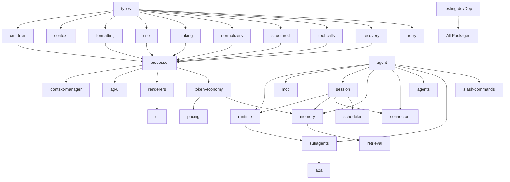

# @agentsy Master Implementation Plan

## Executive Summary

The `@agentsy` platform is a production-oriented TypeScript monorepo for LLM stream parsing, agent infrastructure, and multi-channel integration. This document synthesizes 27 individual plan files into a unified execution roadmap for the 44 packages that comprise the platform.

Currently, 20 packages are live (in various stages of maturity), and 24 new packages are planned. The only published package is `@agentsy/vscode`. This master plan prioritizes development into five tiers and identifies nine critical co-development groups that must advance in lockstep.

---

## Package Inventory (44 Total)

| Tier  | Package            | Status     | Description                                   |
| ----- | ------------------ | ---------- | --------------------------------------------- |
| **0** | `types`            | ✅ Live    | Shared type primitives (foundational)         |
| **0** | `testing`          | 🔲 Planned | Scenario runner, FaultInjector, MockLLM       |
| **0** | `session`          | 🔲 Planned | Session persistence, serialization, branching |
| **0** | `cost-tracker`     | 🔲 Planned | Token cost tracking and budgeting             |
| **0** | `providers`        | 🔲 Planned | Provider capability matrix and quirks         |
| **0** | `secrets`          | 🔲 Planned | Safe secret store, varlock, .env handler      |
| **0** | `retry`            | ✅ Live    | Retry with exponential backoff (PR63)         |
| **0** | `xml-filter`       | ✅ Live    | XML tag filtering and extraction              |
| **0** | `sse`              | ✅ Live    | Server-Sent Events parsing                    |
| **0** | `recovery`         | ✅ Live    | Error recovery and graceful degradation       |
| **1** | `processor`        | ✅ Live    | Central stream processing engine (PR63)       |
| **1** | `context-manager`  | 🔲 Planned | Context window management and reduction       |
| **1** | `runtime`          | 🔲 Planned | Agent runtime orchestration                   |
| **1** | `mcp`              | 🔲 Planned | MCP orchestrator and tool registration        |
| **1** | `telemetry`        | 🔲 Planned | Observability, metrics, and tracing           |
| **1** | `thinking`         | ✅ Live    | Reasoning/thinking block parsing              |
| **1** | `normalizers`      | ✅ Live    | 9 provider stream normalizers                 |
| **1** | `structured`       | ✅ Live    | Structured output parsing (JSON)              |
| **1** | `tool-calls`       | ✅ Live    | Tool call parsing and state (PR63)            |
| **1** | `context`          | ✅ Live    | Context window management primitives          |
| **1** | `formatting`       | ✅ Live    | Output formatting utilities                   |
| **2** | `agent`            | ✅ Live    | Core agent loop implementation                |
| **2** | `memory`           | 🔲 Planned | 3-layer memory engine (raw/wiki/vector)       |
| **2** | `retrieval`        | 🔲 Planned | Vector retrieval and semantic search          |
| **2** | `token-economy`    | 🔲 Planned | Token budgets, reduction, output shaping      |
| **2** | `guardrails`       | 🔲 Planned | Moderation, PII, OWASP test coverage          |
| **2** | `slash-commands`   | 🔲 Planned | SKILL.md parsing, 12 stock commands           |
| **2** | `skills`           | 🔲 Planned | Skills manager, progressive loading           |
| **2** | `agents`           | 🔲 Planned | Unified agent modes (Caveman, Superpowers)    |
| **2** | `adapters`         | ✅ Live    | Orchestration helpers and stream adapters     |
| **2** | `renderers`        | ✅ Live    | Subpath renderers (Plain, CLI, VSCode, Ink)   |
| **2** | `ui`               | ✅ Live    | UI component primitives                       |
| **2** | `ag-ui`            | ✅ Live    | AG-UI protocol types and streaming            |
| **2** | `vscode`           | ✅ Live    | **Published** VS Code Chat Provider utils     |
| **3** | `pacing`           | 🔲 Planned | Rate-aware query execution                    |
| **3** | `scheduler`        | 🔲 Planned | Task scheduling and recurring jobs            |
| **3** | `connectors`       | 🔲 Planned | Channel adapters (Telegram, Slack, etc.)      |
| **3** | `subagents`        | 🔲 Planned | Local coordinator/worker orchestration        |
| **3** | `a2a`              | 🔲 Planned | Agent-to-Agent protocol and interop           |
| **3** | `fileops-mcp`      | 🔲 Planned | CLI-powered file operations MCP server        |
| **3** | `integration`      | ✅ Live    | Private integration testing infrastructure    |
| **4** | `extension-vscode` | ⏳ Future  | Thin VS Code extension composition            |
| **4** | `renderer-gui`     | ⏳ Future  | DisplayPort GUI implementations               |
| **4** | `desktop`          | ⏳ Future  | Electron/Tauri desktop application            |

---

## Dependency Graph

---

## Implementation Priority Tiers

### Tier 0: Foundation

_Objective: Build the base substrate for persistence, security, and testing._

- `testing`: Standardize TDD and scenario runners.
- `session`: Enable persistence for all agentic flows.
- `secrets`: Secure API keys and environment variables.
- `cost-tracker`: Baseline for token economy.
- `providers`: Capability matrix for provider-aware routing.

### Tier 1: Core Runtime

_Objective: Orchestrate agent execution and context management._

- `runtime`: Lifecycle management (start/stop/pause/resume).
- `mcp`: Tool discovery and registration.
- `context-manager`: Active context window reduction and prioritization.
- `telemetry`: Observability for the entire stack.

### Tier 2: Agent Extensions

_Objective: Enhance agents with knowledge, policy, and safety._

- `memory` + `retrieval`: The durable knowledge substrate.
- `token-economy`: Policy-driven compression and budgeting.
- `guardrails`: Safety, moderation, and compliance.
- `skills` + `slash-commands`: Capability management and user interaction.
- `agents`: Unified modes (Caveman, Superpowers, Garry).

### Tier 3: Infrastructure & Interop

_Objective: Connect agents to the world and each other._

- `connectors`: Multi-channel entry points (Telegram, Slack, etc.).
- `pacing`: Intelligent rate-aware execution during dead-time.
- `scheduler`: Automation and recurring tasks.
- `subagents` + `a2a`: Multi-agent orchestration and interop.
- `fileops-mcp`: Power-user filesystem tools for agents.

---

## Co-Development Groups

These packages have interdependent phases and must be developed in lockstep:

1. **Memory Group**: `@agentsy/memory` + `@agentsy/retrieval` (Retrieval is a layer of memory).
2. **Runtime Group**: `@agentsy/agent` + `@agentsy/runtime` + `@agentsy/mcp` (Execution + Lifecycle + Tools).
3. **Session Group**: `@agentsy/session` + `@agentsy/agent` (Agent loop needs session persistence).
4. **Channel Group**: `@agentsy/connectors` + `@agentsy/session` + `@agentsy/agent` (Connectors route to specific agent sessions).
5. **Economy Group**: `@agentsy/token-economy` + `@agentsy/memory` (Memory owns truth, Economy owns policy).
6. **Pacing Group**: `@agentsy/pacing` + `@agentsy/token-economy` (Pacing utilizes Economy for compression).
7. **Safety Group**: `@agentsy/testing` + `@agentsy/guardrails` (Guardrails rely on adversarial testing infrastructure).
8. **Multi-Agent Group**: `@agentsy/subagents` + `@agentsy/a2a` (A2A is the transport for Subagents).
9. **UI Group**: `@agentsy/renderers` + `@agentsy/agent` (The loop that powers the display).

---

## Source Plan Cross-Reference Matrix

| Plan File                  | Key Packages Defined                            |
| -------------------------- | ----------------------------------------------- |
| `agentsy-prd.md`           | Platform Vision, REQ-001→REQ-042                |
| `agentsy-tech.md`          | API Surface for ALL packages                    |
| `agentsy-platform-v2.md`   | Master Roadmap, P0→P12 Phases                   |
| `agentsy-memory.md`        | `memory`, `retrieval`                           |
| `agentsy-token-economy.md` | `token-economy`                                 |
| `pacing-function...`       | `pacing`                                        |
| `agentsy-testing-plan.md`  | `testing`                                       |
| `owasp-security...`        | `guardrails`                                    |
| `agentsy-secrets.md`       | `secrets`                                       |
| `agentsy-connectors...`    | `connectors`                                    |
| `agentsy-scheduler...`     | `scheduler`                                     |
| `agentsy-fileops-mcp.md`   | `fileops-mcp`                                   |
| `agentsy-subagents.md`     | `subagents`, `a2a`                              |
| `agentsy-agents-v1.md`     | `agents`                                        |
| `agentsy-standalone-v1.md` | `renderers`, `extension-vscode`, `renderer-gui` |

---

## Execution Roadmap

1. **Upgrade Existing Packages**: Apply IMPLEMENTATION-PLAN.md tasks to `types`, `processor`, `agent`, etc.
2. **Tier 0 Foundation**: Implement `testing`, `session`, and `secrets` to establish the baseline.
3. **Tier 1 Runtime**: Implement `runtime` and `mcp` to enable full agent lifecycle.
4. **Tier 2 Extensions**: Implement `memory` and `token-economy` to add "intelligence" and "efficiency".
5. **Tier 3 Infrastructure**: Implement `connectors`, `scheduler`, and `interop` to reach production scale.

## Verification Gates

1. **Tier 0 Gate**: 80% coverage on Foundation packages, success in `pnpm install` across all 44 packages.
2. **Tier 1 Gate**: Successful multi-turn agent loop with tool execution and telemetry recording.
3. **Tier 2 Gate**: Retrieval-augmented generation (RAG) with token budgeting and safety moderation.
4. **Tier 3 Gate**: Multi-agent coordination over an external connector (e.g., Telegram) with scheduled tasks.
